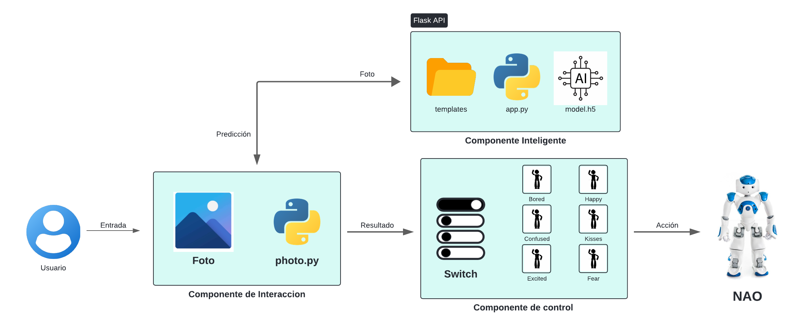

## Alumnos:
- u202122644 Emily Mendoza Manrique
- u202122788 Ayrton Jafet Samaniego Millan
- u202120058 Andrea Katherina Tapia Pescoran
- u202021644 Renato Guillermo Vivas Alejandro

## Objetivo de Implementación
El objetivo de este proyecto es integrar un modelo inteligente de clasificación de basura al robot NAO para permitirle responder de manera autónoma según el tipo de residuo detectado en una imagen. Este sistema utiliza un servidor Flask en Python, que actúa como intermediario entre el usuario, el modelo de clasificación de basura y el robot NAO. La implementación está diseñada para promover una interacción educativa, en la que el robot expresa una emoción específica dependiendo del tipo de residuo clasificado, como plástico, vidrio, papel, material biológico, etc, fomentando una conciencia ambiental en los usuarios.
## Diagrama de Arquitectura de componentes:

    

Para facilitar el entendimiento de la solución y de los componentes que la conforman, se han organizado dichos elementos en tres componentes principales: `Componente de Interacción`, `Componente Inteligente` y `Componente de Control`.

### 1. Componente de Interacción

- Este componente recibe la entrada del usuario en forma de una foto del residuo, que es procesada por un script (photo.py). La imagen es luego enviada al servidor Flask para su análisis.
- Aquí, photo.py actúa como el enlace entre el usuario y el sistema de inteligencia artificial, enviando la imagen al componente inteligente para obtener una predicción sobre el tipo de basura.
### 2. Componente Inteligente:

- Este componente es el núcleo de la inteligencia artificial. Desarrollado en Python, incluye un servidor Flask (app.py) que maneja las solicitudes de predicción.
- Un modelo de clasificación de residuos (model.h5), entrenado con TensorFlow, clasifica la imagen recibida y determina si el residuo es de tipo plástico, vidrio, papel, biológico, entre otros.
- Las predicciones se generan a través de endpoints en la API de Flask, que comunica los resultados al componente de control.
### 3. Componente de Control:

- Este componente recibe la predicción del tipo de basura y determina la emoción que debe expresar el robot NAO.
- Mediante un "switch" de control, el sistema elige entre diferentes respuestas emocionales del robot, como expresar sorpresa, alegría, o preocupación, en función del tipo de basura clasificada.
- Finalmente, la acción seleccionada se envía al robot NAO, permitiéndole realizar la respuesta correspondiente y completar el ciclo de interacción.

## Instrucciones de instalación del modelo en el robot NAO

### 1. Clonar el repositorio: 

Primero, descarga el proyecto desde el repositorio de GitHub, donde se encuentra el código fuente del servidor Flask y el modelo de clasificación de basura.

    git clone https://github.com/andreatpr/goodmodelbadrequests
    cd goodmodelbadrequests

### 2. Construir la imagen Docker: 

Una vez en el directorio del proyecto, utiliza Docker para construir la imagen del servidor Flask con el modelo. Nombra la imagen como `goodmodelbadrequests`.

    docker build -t goodmodelbadrequests .

### 3. Ejecutar el contenedor: 

Después de construir la imagen, ejecuta el contenedor en segundo plano, exponiendo el puerto 5000 del contenedor al puerto 5500 de tu máquina local.

    docker run -d -p 5500:5000 goodmodelbadrequests
### 4. Verificar el contenedor en ejecución:

Para asegurarte de que el contenedor está en funcionamiento, puedes listar los contenedores en ejecución:

    docker ps
### 5. Acceder al servidor Flask: 

Una vez en ejecución, el servidor Flask estará disponible en http://localhost:5500 en tu máquina local.

## Pasos para ejecutar el proyecto en Robot NAO

1. Primero se debe instalar el software para interactuar con el Robot NAO [Choregraphe](https://drive.google.com/file/d/1fJHgV-SHTfVJ_lM82l8ei6bFOo7mlqRH/view?usp=drive_link) y descomprimir el archivo.
   
2. Luego se debe ejecutar el archivo `choregraphe.bat` .Dentro del programa, accede a la opción `Editar > Preferencias` y elige el modelo de robot `NAO H25 (V6)`. Es recomendable cerrar y reiniciar Choregraphe para asegurarse de que los cambios se apliquen correctamente.
   
3. Finalmente solo debe abrir el proyecto del repositorio y ejecutar la simulacion.

Enlace al video de youtube: [PC3-ML-video](https://youtu.be/57WFz137ECU).
